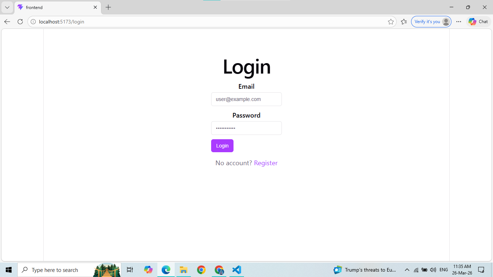
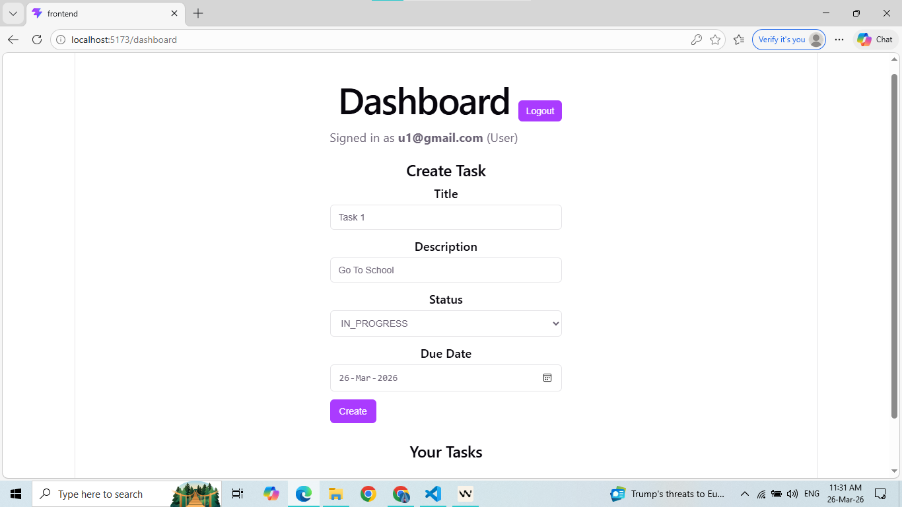
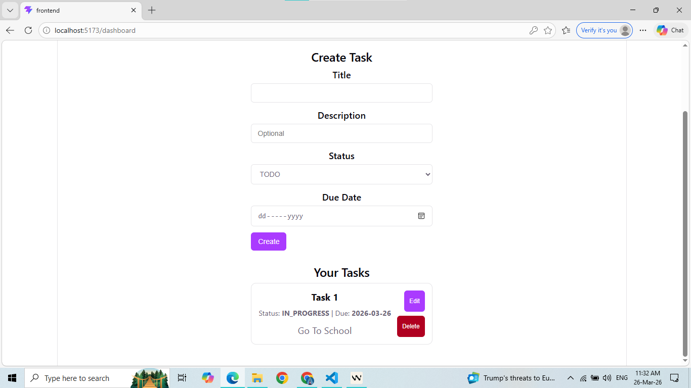
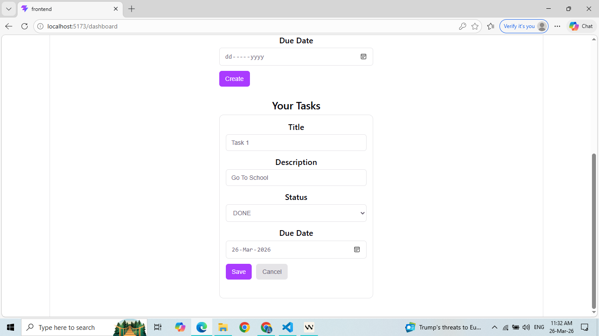
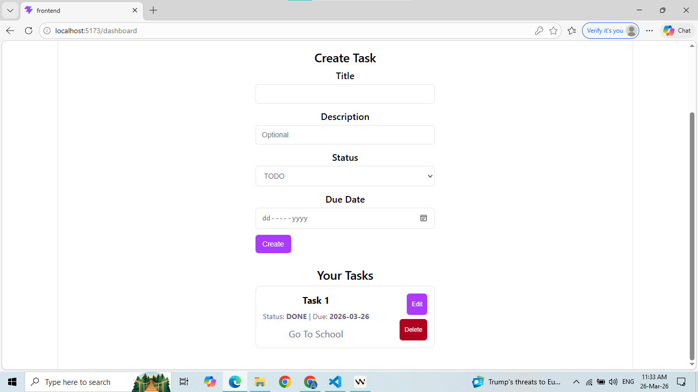
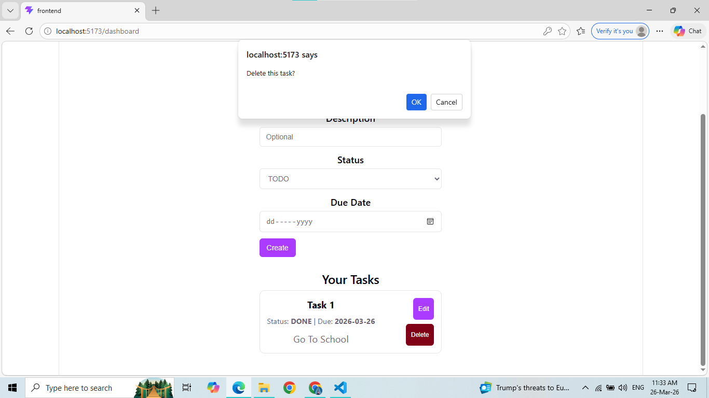
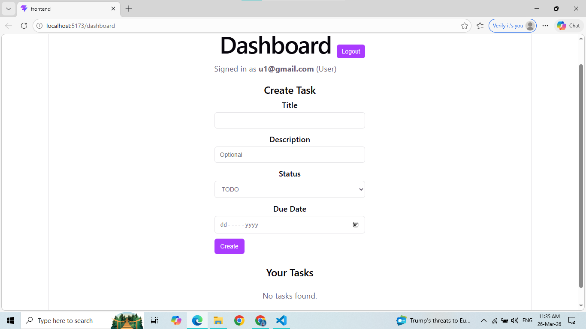

# 🚀 Project P3 - Secure REST API (JWT + RBAC) + Task CRUD UI

This project implements:

* Backend: secure user registration/login with password hashing + JWT auth, role-based access (USER/ADMIN), versioned REST API (`/api/v1`), validation + sanitization, centralized error handling, Swagger docs, Postman collection, and Prisma schema.
* Frontend: React UI to register/login, use JWT for protected requests, and perform full CRUD on tasks.

---

# 📸 UI Screenshots

## 🔐 Authentication

### Login Page



### Register Page



---

## 📊 Dashboard

### Main Dashboard



---

## ✅ Task Management

### Create Task



### Task List



### Update Task



### Delete Task



---

# 🚀 Vercel Deployment Guide

## 📋 Environment Variables

### Backend (.env)

```env
NODE_ENV=production
PORT=3000

DATABASE_URL=

JWT_SECRET=your_super_secret_key
JWT_EXPIRES_IN=15m

CORS_ORIGIN=https://your-frontend.vercel.app
BCRYPT_SALT_ROUNDS=12
```

---

### Frontend (.env)

```env
VITE_API_BASE_URL=https://your-backend.vercel.app/api/v1
```

---

# 📦 Deployment Steps

## 1. Push to GitHub

```bash
git init
git add .
git commit -m "Initial commit"
git branch -M main
git remote add origin <repo-url>
git push -u origin main
```

---

## 2. Deploy Backend (Vercel)

* Root: `backend`
* Build:

```bash
npm install && npx prisma generate
```

---

## 3. Deploy Frontend (Vercel)

* Root: `frontend`
* Framework: Vite

---

## 4. Fix CORS

```env
CORS_ORIGIN=https://your-frontend.vercel.app
```

---

# 🌐 API Endpoints

## Auth

* POST `/api/v1/auth/register`
* POST `/api/v1/auth/login`
* GET `/api/v1/auth/me`

## Tasks

* GET `/api/v1/tasks`
* POST `/api/v1/tasks`
* PUT `/api/v1/tasks/:id`
* DELETE `/api/v1/tasks/:id`

---

# 🧪 Run Locally

## Backend

```bash
cd backend
npm install
npx prisma generate
npx prisma db push
npm run dev
```

---

## Frontend

```bash
cd frontend
npm install
npm run dev
```

---

# 📁 Folder Structure

```
backend/
frontend/
images/
```

---

# 🎉 Features

* JWT Authentication
* Role-Based Access Control
* Full Task CRUD
* PostgreSQL (Supabase)
* Vercel Deployment Ready

---

